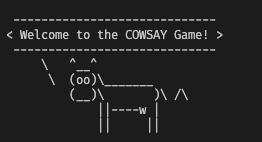
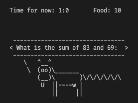
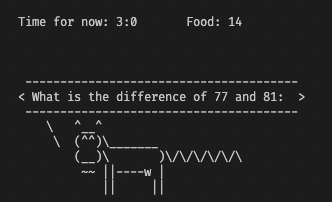
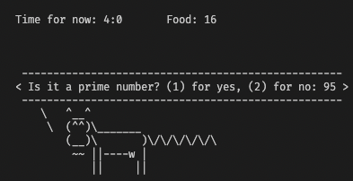
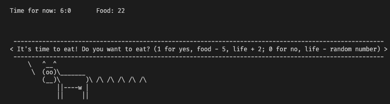
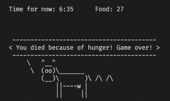

<!--

 * @Author: JIANG Yilun
 * @Date: 2022-04-24 14:28:58
 * @LastEditTime: 2022-04-24 21:15:04
 * @LastEditors: JIANG Yilun
 * @Description: 
 * @FilePath: /Projet_cowsay_L1S2/rapport_cowsay_JIANGYilun.md
-->


# Projet Cowsay

<p align="right"> JIANG Yilun

## Sommaire

[TOC]

## 1. Présentation du Projet `cowsay`

Le projet débute au premier jour du cours INF203 et s'achève lors la dernière semaine de cours. Cette dernière fait date de rendu (dimanche soir minuit de la dernière semaine). Vous pouvez progresser sur le projet a votre rythme, mais nous vous recommandons de prendre de l’avance par rapport au cours, du moins aucun retard. Par exemple, la partie “Bash” devra être achevée au moment ou les premiers cours de “C” débuteront.

## 2. Objectif du projet

L’objectif du projet est de découvrir le monde merveilleux de “cowsay”. Au cours du projet, vous réaliserez les objectifs suivants:

### 1. Préliminaires
Découvrir la commande cowsay a travers son manuel (manpage) et l’ensemble des options qu’elle contient.

### 2. Bash
Implémenter un script Bash qui fait réciter a la vache la suite des nombres premiers, des nombres de Fibonacci, ou toute autre suite exotique de votre choix.

### 3. C
Recoder cowsay en C, avec de nouvelles fonctionnalités additionnelles de votre choix (comme par exemple la longueur de la queue).

### 4. Automates
En s’appuyant sur la théorie des automates, implementer un “cow-Tamagoshi” qu’il s’agit de nourrir et faire survivre aussi longtemps que possible.

## Préliminaires

Découvrir du code `cowsay`:
```bash
cowsay -h
```

Nous avons donc le résultat suivant:

```
cow{say,think} version 3.03, (c) 1999 Tony Monroe
Usage: cowsay [-bdgpstwy] [-h] [-e eyes] [-f cowfile] 
          [-l] [-n] [-T tongue] [-W wrapcolumn] [message]
```

Nous apprenons donc que le projet cowsay contient en fait deux commandes, l'une appelée Cowsay et l'autre Cowthink. Cowsay utilise des lignes droites pour relier la vache aux mots prononcés, tandis que cowthink utilise des cercles.

Par exemple, nous utilise `cowsay ` en première:

```bash
cowsay "Hello, my name is JIANG Yilun"
```

Avec les résultats suivant:

```
 _______________________________ 
< Hello, my name is JIANG Yilun >
 ------------------------------- 
        \   ^__^
         \  (oo)\_______
            (__)\       )\/\
                ||----w |
                ||     ||
```

Ensuit, nous utilise le commande `cowthink`:

```bash
cowthink "Hello, my name is JIANG Yilun"
```

Avec les résultats suivant:

```
 _______________________________ 
( Hello, my name is JIANG Yilun )
 ------------------------------- 
        o   ^__^
         o  (oo)\_______
            (__)\       )\/\
                ||----w |
                ||     ||
```

En fait, le cowsay ne se limite pas à la forme de la vache.  Apres nous utilisons le commande `cowsay -l`, nous pouvons constater que nous avons en fait de nombreux modèles à choisir:

```bash
$ cowsay -l
Cow files in /opt/homebrew/Cellar/cowsay/3.04_1/share/cows:
beavis.zen blowfish bong bud-frogs bunny cheese cower daemon default dragon
dragon-and-cow elephant elephant-in-snake eyes flaming-sheep ghostbusters
head-in hellokitty kiss kitty koala kosh luke-koala meow milk moofasa moose
mutilated ren satanic sheep skeleton small stegosaurus stimpy supermilker
surgery three-eyes turkey turtle tux udder vader vader-koala www
```

Par exemple, on peut utilise la forme `sheep`:

```bash
$ cowsay -f sheep hello
 _______ 
< hello >
 ------- 
  \
   \
       __     
      UooU\.'@@@@@@`.
      \__/(@@@@@@@@@@)
           (@@@@@@@@)
           `YY~~~~YY'
            ||    ||
```

On peut aussi utiliser le vase avec des tuyaux:

```bash
$ ll | cowsay
 ________________________________________ 
/ total 8 -rw-r--r--@ 1 yilunjiang staff \
| 3.6K Apr 24 15:03                      |
\ rapport_cowsay_JIANGYilun.md           /
 ---------------------------------------- 
        \   ^__^
         \  (oo)\_______
            (__)\       )\/\
                ||----w |
                ||     ||
```

En fait, la sortie de cowsay est très pauvre - pratiquement impossible à visualiser très bien. Mais si nous ajoutons la commande -n:

```bash
$ ll | cowsay -n
 __________________________________________________________________________________ 
/ total 16                                                                         \
\ -rw-r--r--@ 1 yilunjiang  staff   4.2K Apr 24 15:09 rapport_cowsay_JIANGYilun.md /
 ---------------------------------------------------------------------------------- 
        \   ^__^
         \  (oo)\_______
            (__)\       )\/\
                ||----w |
                ||     ||
```

De cette façon, les informations décrites peuvent être lues de manière plus visuelle.

La commande cowsay a en fait ces petits extras, par exemple, nous pouvons changer les yeux de la vache:

```bash
$ cowsay -e -- "Hello, my name is JIANG Yilun" 
 _______________________________ 
< Hello, my name is JIANG Yilun >
 ------------------------------- 
        \   ^__^
         \  (--)\_______
            (__)\       )\/\
                ||----w |
                ||     ||
```

Nous avons même réussi à lui faire cracher sa langue:

```bash
$ cowsay -T U "Hello, my name is JIANG Yilun" 
 _______________________________ 
< Hello, my name is JIANG Yilun >
 ------------------------------- 
        \   ^__^
         \  (oo)\_______
            (__)\       )\/\
             U ||----w |
                ||     ||
```

## Bash

En fait, le code présenté ci-dessous a été modifié une deuxième fois (après avoir vu la vache folle) et comporte deux sections distinctes : une avec un argument et une sans.

### cow_kindergarten

```bash
###
 # @Author: JIANG Yilun
 # @Date: 2022-04-24 15:15:21
 # @LastEditTime: 2022-04-24 17:55:56
 # @LastEditors: JIANG Yilun
 # @Description: 
 # @FilePath: /Projet_cowsay_L1S2/cow_kindergarten.sh
### 

if [ $# -eq 0 ]; then
    temp=10
    while [ $temp -gt 0 ]; do
        clear
        cowsay $temp
        sleep 1
        temp=$((temp-1))
    done
else
    temp=$1
    while [ $temp -gt 0 ]; do
        clear
        cowsay $temp
        sleep 1
        temp=$((temp-1))
    done
fi
```


### cow_primaryschool

```bash
###
 # @Author: JIANG Yilun
 # @Date: 2022-04-24 15:33:12
 # @LastEditTime: 2022-04-24 17:54:01
 # @LastEditors: JIANG Yilun
 # @Description: 
 # @FilePath: /Projet_cowsay_L1S2/cow_primaryschool.sh
### 

i=1
if [ $# -eq 0 ]; then
    echo "Saissez un nombre:"
    read nombre
    while [ $i -le $nombre ]; do
        clear
        cowsay $i
        sleep 1
        i=$((i+1))
    done
else
    nombre=$1
    while [ $i -le $nombre ]; do
        clear
        cowsay $i
        sleep 1
        i=$((i+1))
    done
fi
```


### cow_highschool

```bash
###
 # @Author: JIANG Yilun
 # @Date: 2022-04-24 15:37:56
 # @LastEditTime: 2022-04-24 17:52:24
 # @LastEditors: JIANG Yilun
 # @Description: 
 # @FilePath: /Projet_cowsay_L1S2/cow_highschool.sh
### 

i=1

if [ $# -eq 0 ]; then
    echo "Saissez un nombre:"
    read nombre
    while [ $i -le $nombre ]; do
        clear
        cowsay $(($i*$i))
        sleep 1
        i=$((i+1))
    done
else
    nombre=$1
    while [ $i -le $nombre ]; do
        clear
        cowsay $(($i*$i))
        sleep 1
        i=$((i+1))
    done
fi
```


### cow_college

```bash
###
 # @Author: JIANG Yilun
 # @Date: 2022-04-24 15:41:00
 # @LastEditTime: 2022-04-24 17:44:13
 # @LastEditors: JIANG Yilun
 # @Description: 
 # @FilePath: /Projet_cowsay_L1S2/cow_college.sh
### 

# nombres de Finonacci

i=0
j=1

if [ $# -eq 0 ]; then
    echo "Saissez un nombre:"
    read nombre
    while [ $j -lt $nombre ]; do
        cowsay $j
        temp=$((i+j))
        i=$j
        j=$temp
        sleep 1
    done
else
    nombre=$1
    while [ $j -lt $nombre ]; do
        cowsay $j
        temp=$((i+j))
        i=$j
        j=$temp
        sleep 1
    done
fi
```


### cow_university

```bash
###
 # @Author: JIANG Yilun
 # @Date: 2022-04-24 15:55:25
 # @LastEditTime: 2022-04-24 17:42:31
 # @LastEditors: JIANG Yilun
 # @Description: 
 # @FilePath: /Projet_cowsay_L1S2/cow_university.sh
### 

nbr_premier() {
    while [ $i -le $m ]
    do
        p=$(($m%$i))
        if [ $p -eq 0 ]
        then
            break
        else
            i=$((i+1))
        fi
        if [ $i -eq $m ]
        then
            if [ $m -eq $n ]
            then
                echo "$m est un nombre premier"
                cowsay -T U "$m"
            else
                echo "$m est un nombre premier"
                cowsay "$m"
            fi
        fi
    done
}

if [ $# -eq 0 ]; then
    echo "donnez le dernier nombres premiers à calculer"
    read n
    i=2     #le premier nombre premier
    a=$(bc <<< "scale=0; sqrt($n)")  #scale=0 n'affiche pas les décimale, scale=1 la première, etc... sqrt() calcule la racine carré. marche grace à la commande bc
    m=3
    echo "voici sa suite de nombres premiers de $i à $n"
    while [ $m -le $n ]
    do
        echo m:$m
        i=2
        nbr_premier $m
        m=$((m+1))
        sleep 1
    done
else
    n=$1
    i=2     #le premier nombre premier
    a=$(bc <<< "scale=0; sqrt($n)")  #scale=0 n'affiche pas les décimale, scale=1 la première, etc... sqrt() calcule la racine carré. marche grace à la commande bc
    m=3
    echo "voici sa suite de nombres premiers de $i à $n"
    while [ $m -le $n ]
    do
        echo m:$m
        i=2
        nbr_premier $m
        m=$((m+1))
        sleep 1
    done
fi
```


### smart_cow

```bash
###
 # @Author: JIANG Yilun
 # @Date: 2022-04-24 16:27:30
 # @LastEditTime: 2022-04-24 16:40:09
 # @LastEditors: JIANG Yilun
 # @Description: 
 # @FilePath: /Projet_cowsay_L1S2/smart_cow.sh
### 


if [ $# -eq 0 ]; then
    echo "Donner l'expression à calculer:"
    read expression
    cowsay -e $(echo "$expression" | bc) $expression
else
    cowsay -e $(echo "$1" | bc) $1
fi
```


### crazy_cow

```bash
###
 # @Author: JIANG Yilun
 # @Date: 2022-04-24 16:44:04
 # @LastEditTime: 2022-04-24 17:57:02
 # @LastEditors: JIANG Yilun
 # @Description: 
 # @FilePath: /Projet_cowsay_L1S2/crazy_cow.sh
### 

for var in "$@"
do
    if [[ "$var" == "-h" || "$var" == "--help" ]]; then
        echo "Usage: $0 [OPTION]... [FILE]..."
        echo "Print a crazy cow."
    elif [[ "$var" == "-v" || "$var" == "--version" ]]; then
        echo "crazy_cow.sh version 1.0"
    elif [[ "$var" == "-a" || "$var" == "--addition" ]]; then
        sh cow_primaryschool.sh ${@: -1}
    elif [[ "$var" == "-c" || "$var" == "--countdown" ]]; then
        sh cow_kindergarten.sh ${@: -1}
    elif [[ "$var" == "-s" || "$var" == "--square" ]]; then
        sh cow_highschool.sh ${@: -1}
    elif [[ "$var" == "-f" || "$var" == "--finonacci" ]]; then
        sh cow_college.sh ${@: -1}
    elif [[ "$var" == "-p" || "$var" == "--premiere" ]]; then
        sh cow_university.sh ${@: -1}
    elif [[ "$var" == "-S" || "$var" == "--smart" ]]; then
        sh smart_cow.sh ${@: -1}
    fi
done
```


## C

### Question 1

`affiche_vache`:

```C
int affiche_vache()
{
    printf("\n");
    printf("    \\   ^__^\n");
    printf("     \\  (oo)\\_______\n");
    printf("        (__)\\       )\\/\\\n");
    printf("            ||----w |\n");
    printf("            ||     ||\n");
    printf("\n");
    return 0;
}

int main()
{
    affiche_vache();
}
```

Après la compilation, nous avons pu obtenir les résultats suivants:

```bash
$ gcc newcow.c && ./a.out                                                                                                        

    \   ^__^
     \  (oo)\_______
        (__)\       )\/\
            ||----w |
            ||     ||
```


### Question 2

```c
/*
 * @Author: JIANG Yilun
 * @Date: 2022-04-24 18:07:27
 * @LastEditTime: 2022-04-24 18:44:29
 * @LastEditors: JIANG Yilun
 * @Description: 
 * @FilePath: /Projet_cowsay_L1S2/newcow.c
 */

#include <stdio.h>
#include <string.h>

int affiche_vache (char *eyes, char *tongue)
{
    if (eyes == NULL && tongue == NULL){
        printf("\n");
        printf("    \\   ^__^\n");
        printf("     \\  (oo)\\_______\n");
        printf("        (__)\\       )\\/\\\n");
        printf("            ||----w |\n");
        printf("            ||     ||\n");
        printf("\n");
        return 0;
    }
    else if (eyes == NULL && tongue != NULL){
        printf("\n");
        printf("    \\   ^__^\n");
        printf("     \\  (oo)\\_______\n");
        printf("        (__)\\       )\\/\\\n");
        printf("         %s ||----w |\n",tongue);
        printf("            ||     ||\n");
        printf("\n");
        return 0;
    }
    else if (eyes != NULL && tongue == NULL){
        printf("\n");
        printf("    \\   ^__^\n");
        printf("     \\  (%s)\\_______\n",eyes);
        printf("        (__)\\       )\\/\\\n");
        printf("            ||----w |\n");
        printf("            ||     ||\n");
        printf("\n");
        return 0;
    }
    else
    {
        printf("\n");
        printf("    \\   ^__^\n");
        printf("     \\  (%s)\\_______\n",eyes);
        printf("        (__)\\       )\\/\\\n");
        printf("         %s ||----w |\n",tongue);
        printf("            ||     ||\n");
        printf("\n");
        return 0;
    }
}

int main (int argc, char *argv[])
{
    char *eyes = NULL;
    char *tongue = NULL;
    char *message = NULL;
    char *tail = NULL;
    for (int i = 1; i < argc; i++)
    {
        if (strcmp(argv[i], "-e") == 0 || strcmp(argv[i], "--eyes") == 0)
        {
            eyes = argv[i+1];
        }
        if (strcmp(argv[i], "-t") == 0 || strcmp(argv[i], "--tongue") == 0)
        {
            tongue = argv[i+1];
        }
    }
    affiche_vache(eyes, tongue);
}
```

Après la compilation, nous avons pu obtenir les résultats suivants:

```bash
$ gcc test.c && ./a.out -e AA -t U

    \   ^__^
     \  (AA)\_______
        (__)\       )\/\
         U ||----w |
            ||     ||
```


### Question 3

```c
/*
 * @Author: JIANG Yilun
 * @Date: 2022-04-24 18:07:27
 * @LastEditTime: 2022-04-24 21:10:24
 * @LastEditors: JIANG Yilun
 * @Description:
 * @FilePath: /Projet_cowsay_L1S2/newcow.c
 */

#include <stdio.h>
#include <string.h>
#include <stdlib.h>

int affiche_vache(int *length, char *message, char *eyes, char *tongue, int *tail)
{
    printf(" -");
    for (int i = 0; i < *length; i++)
    {
        printf("-");
    }
    printf("\n");
    printf("< %s >\n", message);
    printf(" -");
    for (int i = 0; i < *length; i++)
    {
        printf("-");
    }
    printf("\n");
    printf("    \\   ^__^\n");
    printf("     \\  (%s)\\_______\n", eyes);
    printf("        (__)\\       )\\");
    for (int i = 0; i < *tail; i++)
    {
        printf("/\\");
    }
    printf("\n");
    printf("         %s ||----w |\n", tongue);
    printf("            ||     ||\n");
    printf("\n");
    return 0;
}

void update() { printf("\033[H\033[J"); }

void gotoxy(x, y) { printf("\033[%d;%dH", x, y); }

int main(int argc, char *argv[])
{
    char *eyes = "oo"; // default eyes
    char *tongue = "  "; // default tongue
    char *message = "--help to display help"; // default message
    int tail = 1; // default tail
    for (int i = 1; i < argc; i++)
    {
        if (strcmp(argv[i], "-e") == 0 || strcmp(argv[i], "--eyes") == 0)
        {
            eyes = argv[i + 1];
        }
        if (strcmp(argv[i], "-T") == 0 || strcmp(argv[i], "--tongue") == 0)
        {
            tongue = argv[i + 1];
        }
        if (strcmp(argv[i], "-m") == 0 || strcmp(argv[i], "--message") == 0)
        {
            message = argv[i + 1];
        }
        if (strcmp(argv[i], "-t") == 0 || strcmp(argv[i], "--tail") == 0)
        {
            tail = atoi(argv[i + 1]);
        }
        if (strcmp(argv[i], "-h") == 0 || strcmp(argv[i], "--help") == 0)
        {
            printf("\n");
            printf("Usage: newcow [OPTION]...\n");
            printf("\n");
            printf("Options:\n");
            printf("  -e, --eyes=STRING  eyes of the cow (default: oo)\n");
            printf("  -t, --tongue=STRING tongue of the cow (default:  )\n");
            printf("  -m, --message=STRING message to display (default: none)\n");
            printf("  -h, --help          display this help and exit\n");
            printf("\n");
            return 0;
        }
    }
    int length = strlen(message) + 1;
    affiche_vache(&length, message, eyes, tongue, &tail);
}
```

On peut ajouter d'argument "eyes" ou argument "tongue".

S'il n'y a pas de message d'entrée:

```bash
$ gcc newcow.c && ./a.out -e AA -T U
 ------------------------
< --help to display help >
 ------------------------
    \   ^__^
     \  (AA)\_______
        (__)\       )\/\
         U ||----w |
            ||     ||
```


Si je veux obtenir des informations d'aide:

```bash
$ gcc newcow.c && ./a.out -h        

Usage: newcow [OPTION]...

Options:
  -e, --eyes=STRING  eyes of the cow (default: oo)
  -t, --tongue=STRING tongue of the cow (default:  )
  -m, --message=STRING message to display (default: none)
  -h, --help          display this help and exit
```


Bien sûr, la possibilité d'afficher des messages est essentielle:

```bash
$ gcc newcow.c && ./a.out -e AA -T UU -m "Hello, my name is JIANG Yilun"
 -------------------------------
< Hello, my name is JIANG Yilun >
 -------------------------------
    \   ^__^
     \  (AA)\_______
        (__)\       )\/\
         UU ||----w |
            ||     ||
```


En même temps, nous pouvons définir la longueur du tail:

```bash
$ gcc newcow.c && ./a.out -e AA -T UU -m "Hello, my name is JIANG Yilun" -t 10
 -------------------------------
< Hello, my name is JIANG Yilun >
 -------------------------------
    \   ^__^
     \  (AA)\_______
        (__)\       )\/\/\/\/\/\/\/\/\/\/\/\
         UU ||----w |
            ||     ||
```

### Question 5

```C
/*
 * @Author: JIANG Yilun
 * @Date: 2022-04-25 13:34:08
 * @LastEditTime: 2022-04-26 17:43:29
 * @LastEditors: JIANG Yilun
 * @Description:
 * @FilePath: /Projet_cowsay_L1S2/reading_cow.c
 */

#include <stdio.h>
#include <string.h>
#include <stdlib.h>
#include <unistd.h>
#include <time.h>

#define MAX_LENGTH 512

void affiche_vache(int *length, char *message, char *eyes, char *tongue, int *tail)
{
    printf(" -");
    for (int i = 0; i < *length; i++)
    {
        printf("-");
    }
    printf("\n");
    printf("< %s >\n", message);
    printf(" -");
    for (int i = 0; i < *length; i++)
    {
        printf("-");
    }
    printf("\n");
    printf("    \\   ^__^\n");
    printf("     \\  (%s)\\_______\n", eyes);
    printf("        (__)\\       )\\");
    for (int i = 0; i < *tail; i++)
    {
        printf("/\\");
    }
    printf("\n");
    printf("         %s ||----w |\n", tongue);
    printf("            ||     ||\n");
    printf("\n");
}

void update() { printf("\033[H\033[J"); }

void gotoxy(x, y) { printf("\033[%d;%dH", x, y); }

int main(int argc, char *argv[])
{
    FILE *ficher = NULL;
    ficher = fopen(argv[1], "r");
    if (ficher == NULL)
    {
        printf("Error opening file\n");
        return 1;
    }
    else
    {
        char *eyes = "oo";   // default eyes
        char *tongue = "  "; // default tongue
        char message[MAX_LENGTH] = "";  // default message
        int tail = 1;        // default tail
        int length = 0;
        char c;
        while ((c = fgetc(ficher)) != EOF)
        {
            length++;
            affiche_vache(&length, message, eyes, &c, &tail);
            sleep(1);
            update();
            message[length - 1] = c;
            message[length] = '\0';
        }
        fclose(ficher);
        length++;
        affiche_vache(&length, message, eyes, tongue, &tail);
    }
}
```

Dans le ficher `mot`:

`bonjour, je m'appelle JIANG Yilun`

```bash
$ gcc reading_cow.c && ./a.out mot

 ---------
< bonjour >
 ---------
    \   ^__^
     \  (oo)\_______
        (__)\       )\/\
          ||----w |
            ||     ||

 -----------------------------------
< bonjour, je m'appelle JIANG Yilun >
 -----------------------------------
    \   ^__^
     \  (oo)\_______
        (__)\       )\/\
            ||----w |
            ||     ||

```

La vache épellera le contenu du document un mot à la fois et mettra le caractère suivant dans sa tongue.

Dans ce fichier, j'ai également utilisé `affiche_vache` pour générer la apparition de la vache. 

## Automates

Je n'ai pas réussi à concevoir un automate, car je ne pense pas avoir identifié toutes les possibilités. Mais j'ai créé un mini-jeu "CowSay" qui n'utilise pas d'automate.



Les joueurs doivent répondre à des questions de mathématiques pour obtenir de la nourriture, avec une autre chance d'obtenir de la nourriture toutes les heures.

Ce jeu comporte cinq modèles mathématiques : déterminer si un nombre est premier ou non, ajouter, soustraire, multiplier et trouver le mod entre des nombres.

De plus, des événements aléatoires se produiront dans le scénario du jeu et le joueur peut obtenir des effets négatifs, tels que la perte de nourriture ou de life. Ou vous pouvez activer l'effet "ange", qui vous apporte de la nourriture.

```C
/*
 * @Author: JIANG Yilun
 * @Date: 2022-04-25 15:51:26
 * @LastEditTime: 2022-05-02 14:32:41
 * @LastEditors: JIANG Yilun
 * @Description:
 * @FilePath: /Projet_cowsay_L1S2/Tamagoshi-vache.c
 */

#include <stdio.h>
#include <stdlib.h>
#include <string.h>
#include <unistd.h>
#include <time.h>

#define MAX_LENGTH 512

/*
 * @description: Update(refresh) the Terminal
 * @param {type}: void
 * @return: void
 */
void update() { printf("\033[H\033[J"); }

/*

* @description: Make the pointer to x, y in Terminal
* @param {type}: int x, int y
* @return: void
*/
void gotoxy(x, y) { printf("\033[%d;%dH", x, y); }

int life = 5; // Define the valeur initial to 5

/*

* @description: Print the etat of the cow
* @param {type}: int life
* @return: void
*/
void etat(int life)
{
    if (life == 0 || life == 10)
    {
        printf("byebyelife");
    }
    else if (life <= 3 && life >= 1 || life <= 9 && life >= 7)
    {
        printf("lifesucks");
    }
    else if (life <= 6 && life >= 4 || life)
    {
        printf("liferocks");
    }
}

/*

* @description: Print the cow
* @param {type}: int *length_vache(for define the length of divise), char *message_vache(To print the message), char *eyes_vache(To print the cow's eyes(in default: "oo")), char *tongue_vache(To print the cow's tongue), int *tail_vache(To print the cow's tail(This is also the life of cow)), int time_tick_vache(To define how much time the anmie will take), int hour, int minite, int food
* @return: void
*/
void affiche_vache(int *length_vache, char *message_vache, char *eyes_vache, char *tongue_vache, int *tail_vache, int time_tick_vache, int hour, int minite, int food)
{
    update();
    for (int i = 0; i < time_tick_vache; i++)
    {
        update();
        gotoxy(0, 0);
        printf("Time for now: %d:%d\tFood: %d\n", hour, minite, food);
        gotoxy(5, 0);
        time_t t;
        t = time(NULL);
        if (t % 2 == 0)
        {
            printf(" -");
            for (int i = 0; i <= *length_vache; i++)
            {
                printf("-");
            }
            printf("\n");
            printf("< %s >\n", message_vache);
            printf(" -");
            for (int i = 0; i <= *length_vache; i++)
            {
                printf("-");
            }
            printf("\n");
            printf("    \\   ^__^\n");
            printf("     \\  (%s)\\_______\n", eyes_vache);
            printf("        (__)\\       )\\");
            for (int i = 0; i < *tail_vache; i++)
            {
                printf("/\\");
            }
            printf("\n");
            printf("         %s ||----w |\n", tongue_vache);
            printf("            ||     ||\n");
            printf("\n");
        }
        else
        {
            printf(" -");
            for (int i = 0; i <= *length_vache; i++)
            {
                printf("-");
            }
            printf(" \n");
            printf("< %s >\n", message_vache);
            printf(" -");
            for (int i = 0; i <= *length_vache; i++)
            {
                printf("-");
            }
            printf(" \n");
            printf("     \\   ^__^\n");
            printf("      \\  (%s)\\_______\n", "oo");
            printf("         (__)\\       )\\");
            for (int i = 0; i < *tail_vache; i++)
            {
                printf(" /\\");
            }
            printf(" \n");
            printf("          %s ||----w |\n", "  ");
            printf("             ||     ||\n");
            printf(" \n");
        }
        // gotoxy(10, 0);
        sleep(1);
    }
}

/*
* @description: count the time
* @param {type}: int *hour, int *minite, int *food
* @return: arr[hour, minite]
*/
void time_count(int time_tick, int hour, int minite, int arr[])
{
    minite += 5;
    if (minite >= 60)
    {
        hour += 1;
        minite -= 60;
    }
    if (hour >= 24)
    {
        hour -= 24;
    }
    arr[0] = hour;
    arr[1] = minite;
}

/*
* @description: check if the enter number is a prime number
* @param {type}: int nombre
* @return: int
*/

int check_prime_number(int nombre)
{
    int i;
    for (i = 2; i < nombre; i++)
    {
        if (nombre % i == 0)
        {
            return 0;
        }
    }
    return 1;
}

/*
* @description: Main function
* @param {type}: int argc, char *argv[]
* @return: int
*/

int main(int argc, char *argv[])
{
    // Begin the game, define the variables
    int tail = 1;
    int life = 5;
    int food = 10;
    int time_tick = 5;
    char *eyes = "oo";
    char *tongue = "  ";
    int minite = 0;
    int hour = 0;

    // Define the opening message
    char message[MAX_LENGTH] = "Welcome to the COWSAY Game!";
    int length = strlen(message);
    tongue = "U ";
    affiche_vache(&length, message, eyes, tongue, &tail, time_tick, hour, minite, food);

    // Define the message of providing the name of the player
    strcpy(message, "Please enter your name: ");
    // *message = "Please enter your name: ";
    length = strlen(message);
    affiche_vache(&length, message, eyes, tongue, &tail, 2, hour, minite, food);

    // Define the name of the player and get the name from keyboard.
    char name[20];
    scanf("%s", name);

    // Welcome the player
    strcpy(message, "Hello ");
    strcat(message, name);
    length = strlen(message);
    affiche_vache(&length, message, eyes, tongue, &tail, time_tick, hour, minite, food);

    // Define the speed of the game, (4) for super fast (developer mode xd)
    strcpy(message, "Please choose the speed of the game: (1) for slow, (2) for medium (default), (3) for fast");
    length = strlen(message);
    affiche_vache(&length, message, eyes, tongue, &tail, 1, hour, minite, food);

    // Define the speed of the game, and get the value from keyboard.
    int game_speed;
    scanf("%d", &game_speed);

    if (game_speed == 1)
    {
        strcpy(message, "You chose the slow speed, the game will be played in 10 seconds");
        length = strlen(message);
        affiche_vache(&length, message, eyes, tongue, &tail, time_tick, hour, minite, food);
        time_tick = 8;
    }
    else if (game_speed == 2)
    {
        strcpy(message, "You chose the medium speed, the tivk will be 5 seconds");
        length = strlen(message);
        affiche_vache(&length, message, eyes, tongue, &tail, time_tick, hour, minite, food);
        time_tick = 5;
    }
    else if (game_speed == 3)
    {
        strcpy(message, "You chose the fast speed, the tick will be 3 seconds");
        length = strlen(message);
        affiche_vache(&length, message, eyes, tongue, &tail, time_tick, hour, minite, food);
        time_tick = 3;
    }
    else if (game_speed == 4)
    {
        strcpy(message, "You chose the super fast speed, the tick will be 1 seconds");
        length = strlen(message);
        affiche_vache(&length, message, eyes, tongue, &tail, time_tick, hour, minite, food);
        time_tick = 1;
    }
    else
    {
        strcpy(message, "You chose the wrong thing, so the game will play in default speed, the tick will be 5 seconds");
        length = strlen(message);
        affiche_vache(&length, message, eyes, tongue, &tail, time_tick, hour, minite, food);
        time_tick = 5;
    }

    int i = 0; // i is the number of the loop, not using later but just left there if needed

    while (life > 0 && life < 10)
    {
        // Count the time, with returning the value of the time in an array: arr[hour, minite]
        int arr[2];
        strcpy(message, "...");
        length = strlen(message);
        time_count(time_tick, hour, minite, arr);
        hour = arr[0];
        minite = arr[1];
        tail = life;
        affiche_vache(&length, message, eyes, tongue, &tail, time_tick, hour, minite, food);

        i++;
        update();

        // Check if minite is equal to 60, if yes its time to play a game/
        if (minite == 0)
        {
            // Define the message of playing game.
            strcpy(message, "It's time to think about something!");
            length = strlen(message);
            affiche_vache(&length, message, eyes, tongue, &tail, time_tick, hour, minite, food);
            
            // Define a random number between 1 to 5, to chose which kind of math problem we will use.
            int random_number = rand() % (4) + 1;
            srand(time(NULL)); // Initialize the random number generator.
            
            // If random is equal to 1 then we will use the prime problem.
            if (random_number == 1)
            {
                // Define the message of the prime problem, from 0 to 100.
                int nombre_premier = rand() % 100;
                // Initialize the message to be displayed.
                strcpy(message, "Is it a prime number? (1) for yes, (2) for no: ");
                // Make the prime number to be displayed.
                char str_nombre_premier[MAX_LENGTH] = "";
                sprintf(str_nombre_premier, "%d", nombre_premier);
                // Make message and prime number to be together.
                strcat(message, str_nombre_premier);

                length = strlen(message);
                affiche_vache(&length, message, eyes, tongue, &tail, time_tick, hour, minite, food);

                // Get the answer from keyboard.
                int answer = 0;
                scanf("%d", &answer);
                if (answer == 1)
                {
                    if (check_prime_number(nombre_premier))
                    {
                        strcpy(message, "Yes, it is a prime number! You got it! Food + 2");
                        length = strlen(message);
                        eyes = "^^";
                        tongue = "~~";
                        affiche_vache(&length, message, eyes, tongue, &tail, time_tick, hour, minite, food);
                        food += 2;
                    }
                    else
                    {
                        strcpy(message, "No, it is not a prime number! You lost it!");
                        length = strlen(message);
                        affiche_vache(&length, message, eyes, tongue, &tail, time_tick, hour, minite, food);
                    }
                }
                else
                {
                    if (check_prime_number(nombre_premier))
                    {
                        strcpy(message, "Yes, it is a prime number! You lost it!");
                        length = strlen(message);
                        affiche_vache(&length, message, eyes, tongue, &tail, time_tick, hour, minite, food);
                    }
                    else
                    {
                        strcpy(message, "No, it is not a prime number! You got it! Food + 2");
                        length = strlen(message);
                        eyes = "^^";
                        tongue = "~~";
                        affiche_vache(&length, message, eyes, tongue, &tail, time_tick, hour, minite, food);
                        food += 2;
                    }
                }
            }
            // If random is equal to 2 then we will use the addition problem.
            else if (random_number == 2)
            {
                // Define the 2 values of the addition problem, from 0 to 100.
                int nombre_1 = rand() % 100;
                int nombre_2 = rand() % 100;
                // Initialize the message to be displayed.
                strcpy(message, "What is the sum of ");
                // Make the two numbers to be displayed.
                char str_nombre_1[MAX_LENGTH] = "";
                char str_nombre_2[MAX_LENGTH] = "";
                sprintf(str_nombre_1, "%d", nombre_1);
                sprintf(str_nombre_2, "%d", nombre_2);
                strcat(message, str_nombre_1);
                strcat(message, " and ");
                strcat(message, str_nombre_2);
                strcat(message, ": ");

                length = strlen(message);
                affiche_vache(&length, message, eyes, tongue, &tail, time_tick, hour, minite, food);

                // Get the answer from keyboard.
                int answer = 0;
                scanf("%d", &answer);
                if (answer == nombre_1 + nombre_2)
                {
                    strcpy(message, "Yes, it is the sum of ");
                    strcat(message, str_nombre_1);
                    strcat(message, " and ");
                    strcat(message, str_nombre_2);
                    strcat(message, "! You got it! Food + 2");
                    length = strlen(message);
                    eyes = "^^";
                    tongue = "~~";
                    affiche_vache(&length, message, eyes, tongue, &tail, time_tick, hour, minite, food);
                    food += 2;
                }
                else
                {
                    strcpy(message, "No, it is not the sum of ");
                    strcat(message, str_nombre_1);
                    strcat(message, " and ");
                    strcat(message, str_nombre_2);
                    strcat(message, "! You lost it!");
                    length = strlen(message);
                    affiche_vache(&length, message, eyes, tongue, &tail, time_tick, hour, minite, food);
                }
            }
            // multiplication
            else if (random_number == 3)
            {
                int nombre_1 = rand() % 100;
                int nombre_2 = rand() % 10;
                strcpy(message, "What is the product of ");
                char str_nombre_1[MAX_LENGTH] = "";
                char str_nombre_2[MAX_LENGTH] = "";
                sprintf(str_nombre_1, "%d", nombre_1);
                sprintf(str_nombre_2, "%d", nombre_2);
                strcat(message, str_nombre_1);
                strcat(message, " and ");
                strcat(message, str_nombre_2);
                strcat(message, ": ");

                length = strlen(message);
                affiche_vache(&length, message, eyes, tongue, &tail, time_tick, hour, minite, food);
                int answer = 0;
                scanf("%d", &answer);
                if (answer == nombre_1 * nombre_2)
                {
                    strcpy(message, "Yes, it is the product of ");
                    strcat(message, str_nombre_1);
                    strcat(message, " and ");
                    strcat(message, str_nombre_2);
                    strcat(message, "! You got it! Food + 2");
                    length = strlen(message);
                    eyes = "^^";
                    tongue = "~~";
                    affiche_vache(&length, message, eyes, tongue, &tail, time_tick, hour, minite, food);
                    food += 2;
                }
                else
                {
                    strcpy(message, "No, it is not the product of ");
                    strcat(message, str_nombre_1);
                    strcat(message, " and ");
                    strcat(message, str_nombre_2);
                    strcat(message, "! You lost it!");
                    length = strlen(message);
                    affiche_vache(&length, message, eyes, tongue, &tail, time_tick, hour, minite, food);
                }
            }
            // difference
            else if (random_number == 4)
            {
                int nombre_1 = rand() % 100;
                int nombre_2 = rand() % 100;
                strcpy(message, "What is the difference of ");
                char str_nombre_1[MAX_LENGTH] = "";
                char str_nombre_2[MAX_LENGTH] = "";
                sprintf(str_nombre_1, "%d", nombre_1);
                sprintf(str_nombre_2, "%d", nombre_2);
                strcat(message, str_nombre_1);
                strcat(message, " and ");
                strcat(message, str_nombre_2);
                strcat(message, ": ");

                length = strlen(message);
                affiche_vache(&length, message, eyes, tongue, &tail, time_tick, hour, minite, food);
                int answer = 0;
                scanf("%d", &answer);
                if (answer == nombre_1 - nombre_2)
                {
                    strcpy(message, "Yes, it is the difference of ");
                    strcat(message, str_nombre_1);
                    strcat(message, " and ");
                    strcat(message, str_nombre_2);
                    strcat(message, "! You got it! Food + 2");
                    length = strlen(message);
                    eyes = "^^";
                    tongue = "~~";
                    affiche_vache(&length, message, eyes, tongue, &tail, time_tick, hour, minite, food);
                    food += 2;
                }
                else
                {
                    strcpy(message, "No, it is not the difference of ");
                    strcat(message, str_nombre_1);
                    strcat(message, " and ");
                    strcat(message, str_nombre_2);
                    strcat(message, "! You lost it!");
                    length = strlen(message);
                    affiche_vache(&length, message, eyes, tongue, &tail, time_tick, hour, minite, food);
                }
            }
            // mod
            else if (random_number == 5)
            {
                int nombre_1 = rand() % 100;
                int nombre_2 = rand() % 10;
                strcpy(message, "What is the mod of ");
                char str_nombre_1[MAX_LENGTH] = "";
                char str_nombre_2[MAX_LENGTH] = "";
                sprintf(str_nombre_1, "%d", nombre_1);
                sprintf(str_nombre_2, "%d", nombre_2);
                strcat(message, str_nombre_1);
                strcat(message, " and ");
                strcat(message, str_nombre_2);
                strcat(message, ": ");

                length = strlen(message);
                affiche_vache(&length, message, eyes, tongue, &tail, time_tick, hour, minite, food);
                int answer = 0;
                scanf("%d", &answer);
                if (answer == nombre_1 % nombre_2)
                {
                    strcpy(message, "Yes, it is the mod of ");
                    strcat(message, str_nombre_1);
                    strcat(message, " and ");
                    strcat(message, str_nombre_2);
                    strcat(message, "! You got it! Food + 2");
                    length = strlen(message);
                    eyes = "^^";
                    tongue = "~~";
                    affiche_vache(&length, message, eyes, tongue, &tail, time_tick, hour, minite, food);
                    food += 2;
                }
                else
                {
                    strcpy(message, "No, it is not the mod of ");
                    strcat(message, str_nombre_1);
                    strcat(message, " and ");
                    strcat(message, str_nombre_2);
                    strcat(message, "! You lost it!");
                    length = strlen(message);
                    affiche_vache(&length, message, eyes, tongue, &tail, time_tick, hour, minite, food);
                }
            }
        }

        // If it's 6h, 12h, 18h, 24h then its time to eat, the player can choose if they want to feed the cow or not
        if (hour % 6 == 0 && minite == 0)
        {
            strcpy(message, "It's time to eat! Do you want to eat? (1 for yes, food - 5, life + 2; 0 for no, life - random number)");
            length = strlen(message);
            affiche_vache(&length, message, eyes, tongue, &tail, time_tick, hour, minite, food);
            
            // Ask for the player if he wants to feed
            int answer = 0;
            scanf("%d", &answer);
            if (answer == 1)
            {
                if (food > 0)
                {
                    food -= 5;
                    strcpy(message, "You ate! Food - 5");
                    length = strlen(message);
                    life += 2;
                    eyes = "^^";
                    tongue = "~~";
                    affiche_vache(&length, message, eyes, tongue, &tail, time_tick, hour, minite, food);
                }
                else
                {
                    strcpy(message, "You don't have enough food!");
                    length = strlen(message);
                    int random_number = (rand() % (life - 2)) + 1;
                    life -= random_number;
                    eyes = "~~";
                    tongue = "^";
                    affiche_vache(&length, message, eyes, tongue, &tail, time_tick, hour, minite, food);
                }
            }
            else
            {
                int random_number = (rand() % (life - 2)) + 1;
                life -= random_number;
                strcpy(message, "You didn't eat! Life - ");
                char str_random_number[MAX_LENGTH] = "";
                sprintf(str_random_number, "%d", random_number);
                strcat(message, str_random_number);
                length = strlen(message);
                eyes = "~~";
                tongue = "^";
                affiche_vache(&length, message, eyes, tongue, &tail, time_tick, hour, minite, food);
            }
        }
        // random event
        // Thunder: life - 2
        if (hour + minite == rand() % 100)
        {
            strcpy(message, "It's a thunder! You lost life!");
            length = strlen(message);
            life -= 2;
            eyes = "~~";
            tongue = "^";
            affiche_vache(&length, message, eyes, tongue, &tail, time_tick, hour, minite, food);
        }
        // Hunger: food - 4
        else if (hour + minite == rand() % 100)
        {
            strcpy(message, "It's a hunger! You lost food!");
            length = strlen(message);
            food -= 4;
            eyes = "~~";
            tongue = "^";
            affiche_vache(&length, message, eyes, tongue, &tail, time_tick, hour, minite, food);
        }
        // Fire: life - 2 && food - 2
        else if (hour + minite == rand() % 100)
        {
            strcpy(message, "It's a fire! You lost life and food!");
            length = strlen(message);
            life -= 2;
            food -= 2;
            eyes = "~~";
            tongue = "^";
            affiche_vache(&length, message, eyes, tongue, &tail, time_tick, hour, minite, food);
        }
        // Mercy: food + 5
        else if (hour + minite == rand() % 100)
        {
            strcpy(message, "Mercy is coming! Food + 5");
            length = strlen(message);
            eyes = "^^";
            tongue = "~~";
            food += 5;
            affiche_vache(&length, message, eyes, tongue, &tail, time_tick, hour, minite, food);
        }
    }
    if (life <= 0)
    {
        strcpy(message, "You died because of hunger! Game over!");
        length = strlen(message);
        eyes = "xx";
        tongue = "U ";
        affiche_vache(&length, message, eyes, tongue, &tail, time_tick, hour, minite, food);
    }
    else if (life >= 10)
    {
        strcpy(message, "You died because of trop plein! Game over!");
        length = strlen(message);
        eyes = "xx";
        tongue = "U ";
        affiche_vache(&length, message, eyes, tongue, &tail, time_tick, hour, minite, food);
    }
}
```

#### Problème Mathématique

Case addition:



Case difference:



Case nombre prime:




#### Temp de manger:




#### Mort de faim


